APPLLERGY APP


Motivation:

Have you ever wondered what exactly it was in the food you consumed that you were allergic to? Ever needed to avoid food with similar characteristics to prevent an allergic reaction, without actually knowing if you could consume it?  

APPLLERGY aims to reduce that ambiguity, by cross-checking foods that one is allergic to and narrowing down the list of allergens for them. Awareness of what one is allergic to will increase their safety, while preventing them from needing to restrict their food consumption due to confusion of what exactly they are allergic to.


User Stories:

1. As someone who is allergic to certain foods but am unsure of what substance it is specifically, I want to:
(A) Find out what substance it is exactly (the allergen), so that I can avoid foods containing the allergen.
(B) Input an allergen to find out what other possible allergies I may have so that I can be aware of them and avoid foods containing these allergens.
(C) Have a user profile where I can retrieve my possible allergens so that I can keep track of them easily.
(D) Check whether the food I want to consume contains any of the allergens so that I can avoid it if needed.
(E) Enter the symptoms I am experiencing so that I can find out if I am experiencing an allergic reaction, and if so, gauge the severity of symptoms so that I can decide the appropriate course of action.
(F) Be able to access my emergency contact immediately through the app so that I can get help if any serious allergic reaction occurs
2. As someone who is the caretaker or friend of a person who has food allergies, I want to:
(A) Access their user profile (with prior app permission) to view their allergens as and when necessary so that I can be aware of their allergens and take necessary precautions.


Use Cases:

For all use cases below, the System is our mobile app, Appllergy, and the Actor is the user, unless specified otherwise. 

Use case: Register an account

MSS (Main Success Scenario)
User enters an email.
User enters a password.
User confirms the password.
User registers.
Appllergy brings the user to a welcome screen.
User acknowledges the welcome screens.
Appllergy brings the user to the home screen
Use case ends.

Extensions
1a. User entered an email that already exists.
		1a1. Appllergy displays an error message.
		Use case resumes at step 1.
	1b. User entered an email with invalid format.
		1b1. Appllergy displays an error message.
		Use case resumes at step 1.
	2a. User enters a password that is less than 6 characters.
		2a1. Appllergy displays an error message.
		Use case resumes at step 2.
	3a. User enters a password that does not match.
		3a1. Appllergy displays an error message.
		Use case resumes at step 3.
	4a. User fails to fill in all the required details.
		4a1. Appllergy displays an error message.
		Use case stays at step 4.

Use case: Sign in

MSS
User enters an email.
User enters a password.
User signs in.
Appllergy brings them to the home screen.
Use case ends

Extensions
	1a. User entered an email with invalid format.
		1a1. Appllergy displays an error message.
		Use case resumes at step 1.
	3a. User fails to fill in all the required details.
		3a1. Appllergy displays an error message.
		Use case stays at step 3.
	3b. User account is not found.
		3b1. Appllergy displays an error message.
		Use case stays at step 3.
	3c. User enters correct email but incorrect password.
		3c1. Appllergy displays an error message.
		Use case stays at step 3.

Use case: Find allergen

MSS
User adds the food(s) that he/she is allergic to.
Appllergy displays the common allergen in those foods.
User can choose to store those allergens into his/her user profile.
If step 3 is executed, Appllergy stores those allergens into the user profile.
Use case ends.

Extensions
	1a. User adds a food that is not in the database.
		1a1. Appllergy displays an error message.
		Use case continues.
	2a. User fails to fill in all the required details.
		2a1. Appllergy displays an error message.
		Use case stays at step 2.
	3a. User wants to store the allergens but they are already in the user profile.
		3a1 Appllergy displays an error message.
		Use case stays at step 3.

Use case: Find foods

MSS
User adds the allergen(s) that he/she is allergic to.
Appllergy displays the foods that contain those allergen.
User can choose to store those foods into his/her user profile.
If step 3 is executed, Appllergy stores those foods into the user profile.
Use case ends.

Extensions
1a. User adds an allergen that is not in the database.
		1a1. Appllergy displays an error message.
		Use case continues.
	2a. User fails to fill in all the required details.
		2a1. Appllergy displays an error message.
		Use case stays at step 2.
3a. User wants to store the foods but they are already in the user profile.
		3a1 Appllergy displays an error message.
		Use case stays at step 3.

Use case: Check food

MSS
User adds the food that they want to check.
Appllergy displays all the allergens in that food and whether it is also stored in the user profile.
Use case ends.

Extensions
1a. User adds a food that is not in the database.
		1a1. Appllergy displays an error message.
		Use case continues.
	2a. User fails to fill in all the required details.
		2a1. Appllergy displays an error message.
		Use case stays at step 2.

Use case: Check symptoms

MSS
User enters a food to check the allergy symptoms associated with it.
Appllergy displays the allergy symptoms associated with that food.
Use case ends.

Extensions
	1a. User adds a food that is not in the database.
		1a1. Appllergy displays an error message.
		Use case continues.
	2a. User fails to fill in all the required details.
		2a1. Appllergy displays an error message.
		Use case stays at step 2.

Use case: User profile

MSS
Appllergy displays the user photograph, foods/allergens that the user is allergic to and the unique symptoms that the user will experience if he/she experiences an allergic reaction.
The user can choose to manually add the foods/allergens that he/she is allergic to as well as his/her allergy symptoms.
Appllergy updates the user profile if step 2 is executed.
Use case ends.

Extensions
	2a. User adds a food/allergen that is already in the user profile
		2a1. Appllergy displays an error message
		Use case stays at step 2.

Use case: Settings

MSS
User can access his/her emergency contacts.
User can add/remove the emergency contacts.
Appllergy will update the changes if step 2 is executed.
Use case ends.

Extensions
	2a. User adds a emergency contact that is already in the user profile
		2a1. Appllergy displays an error message
		Use case stays at step 2.

Use case: Linked Accounts 

MSS
User can access the user profile of all the linked accounts.
User can add/remove linked accounts.
Appllergy will update the changes if step 2 is executed.
Use case ends.

Extensions
2a. User adds a account that is already in the user profile
		2a1. Appllergy displays an error message
		Use case stays at step 2.

Use case:  Log out

MSS
Appllergy will bring the user back to the home screen.
Use case ends.

Extensions
NIL

Use case: Emergency call

MSS
User can call 995 directly if they experience a severe allergic reaction.
Appllergy will notify all emergency contacts associated with the user to let them know of the emergency situation.
Use case ends.

Extensions
NIL

Features:

Our mobile app, Appllergy, makes use of a database of food, their ingredients and common allergens to solve food allergy related inquiries. Furthermore, we also provide a local database in the user profile that stores the users’ allergens, allowing them to access them easily if required.

We have come up with 5 features which will help users with their food allergy related problems or inquiries. These features will be accessible from the home screen as shown below.

    ```md
    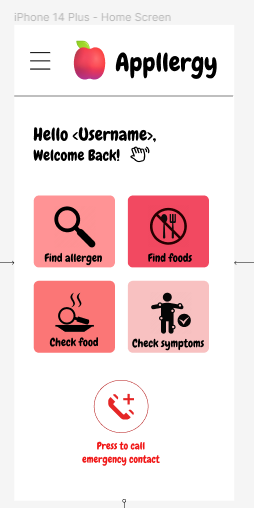
    ```

The 5 features are: find allergen, find foods, check food, check symptoms and option to call the emergency contact. These features are further listed below with a description of their functions, along with illustrations on how they will look and function from the user’s perspective.

1. Find Allergen (Main feature)

This feature is an interface where users can enter multiple foods to find out what allergens they are allergic to. This is done by filtering through the database that is stored in the app’s backend to give the correct output for the users.

    ```md
    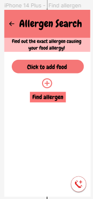
    ```

    ```md
    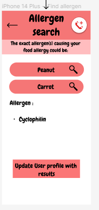
    ```

On the left screen, the user is able to add all the food that they are allergic to. Then, they can press the find allergen button to find the exact allergens they are allergic to. For example, on the screen on the right, the user has entered peanut and carrot as the food that they are allergic to. After they have pressed the find allergen button, our app filters through the database to get cyclophilin as the common allergen in both of these foods. Finally, users are able to update the local database to store this allergen by pressing the ‘update user profile with results’ button.

2. Find foods (Main feature)

This feature is an interface where users can enter allergens to find out what foods they are potentially allergic to. This is done by filtering through the database that is stored in the app’s backend to give the correct output for the users.

    ```md
    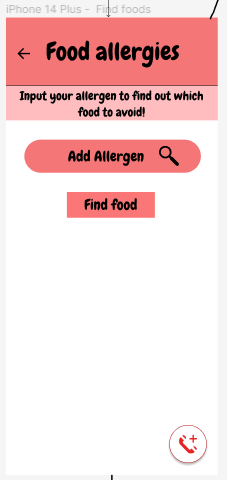
    ```

    ```md
    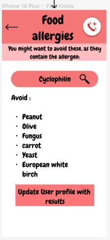
    ```

This is similar to the feature above except that the user can add allergens to find the foods that contain these allergens instead. With this information, the user can avoid these foods or seek confirmation from a medical expert. 

The screen below shows the local database that is stored in the user profile. It has an additional method for users to store the food or allergens manually if they have prior knowledge about their conditions before using our features.

    ```md
    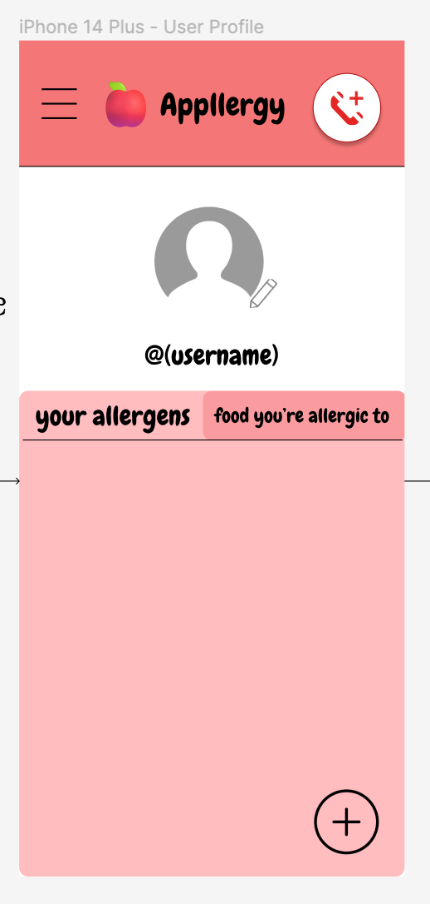
    ```

    ```md
    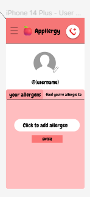
    ```

3. Check food (Extension feature)

Suppose the user is unsure whether they are allergic to a particular food. Then instead of manually scanning through the food that they are allergic to in the local database stored in their user profile, this feature allows them to easily filter through that database and give the output instead.

    ```md
    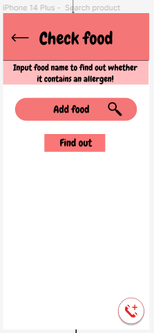
    ```

    ```md
    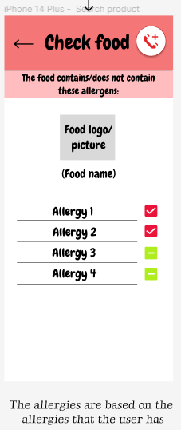
    ```

4. Check symptoms (Extension feature)

Users who are feeling physically unwell can search the common allergic symptoms corresponding to the food allergy, such as peanut allergy, as shown below. 

    ```md
    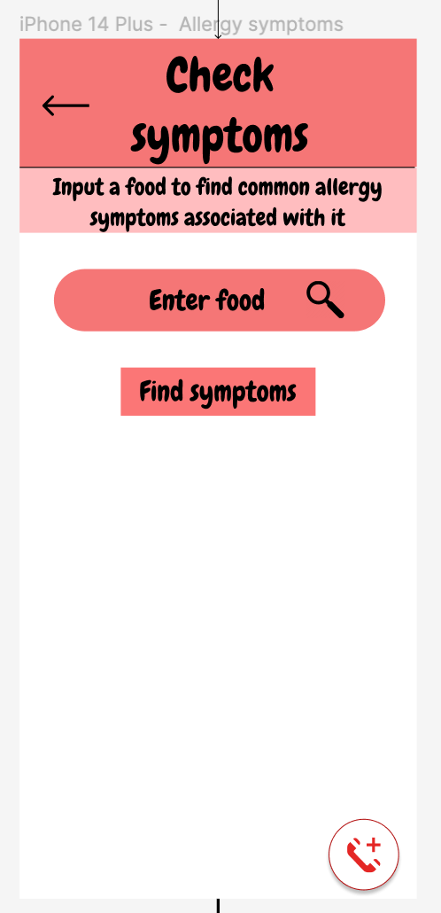
    ```

    ```md
    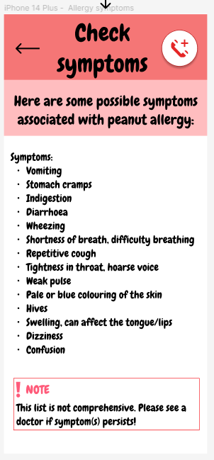
    ```

The user can use this to determine if they are having an allergic reaction to a food they had just eaten, or whether it is non-allergy-related. Additionally, if they had accidentally eaten a food they were allergic to and wanted to find out the symptoms so they could take countermeasures such as buying medicine, they can simply search that food and thus have a way of predicting the symptoms they are likely to have.

5. Emergency call (Extension feature)

Users who are experiencing a severe allergic reaction may press on the call button, available on every screen within the app, to call 995. This button, when pressed, also sends an alert message to the user’s listed emergency contacts to let them know there is an emergency. The screen below shows the emergency contact information, where one can add, edit and delete contacts as they wish.

    ```md
    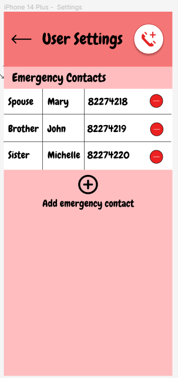
    ```